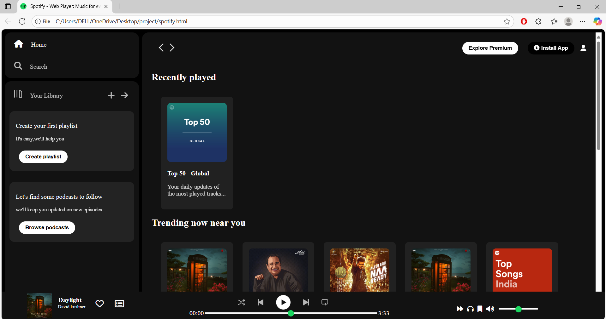
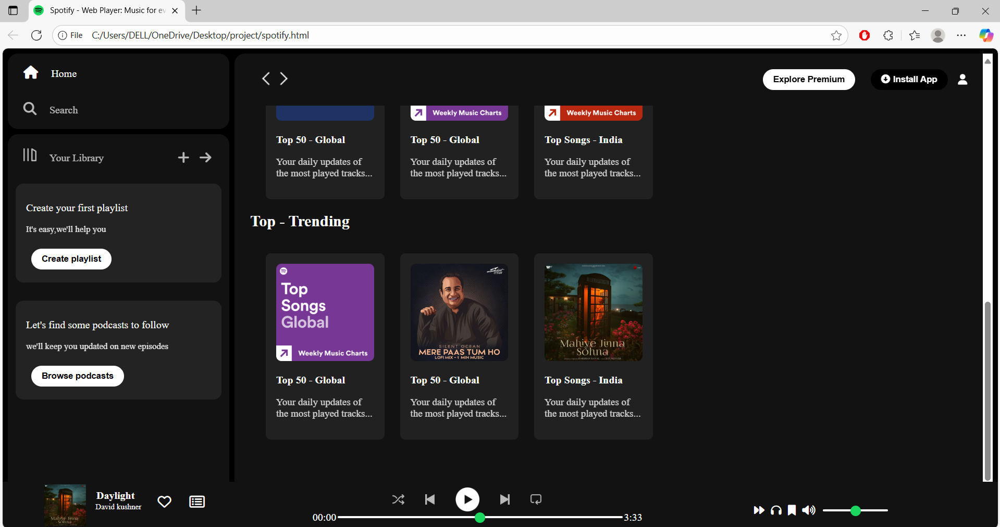

🎵 Spotify Clone (HTML & CSS)

This is a Spotify Web Player Clone built using only HTML and CSS. It replicates the look and feel of Spotify’s music player interface and is created to practice front-end web development skills.

⸻

📌 Features
	•	🎨 Fully designed UI with HTML & CSS only
	•	📂 Playlist and sidebar layout
	•	🎶 Music player controls (UI only)
	•	📱 Responsive design for desktop & mobile

⸻

🛠 Tech Stack
	•	HTML5
	•	CSS3

  📷 Screenshots
  
  

  🤝 Contributing

This is a beginner project for learning purposes. Suggestions and improvements are welcome!

⸻

📄 License

This project is licensed under the MIT License – free to use and modify.
